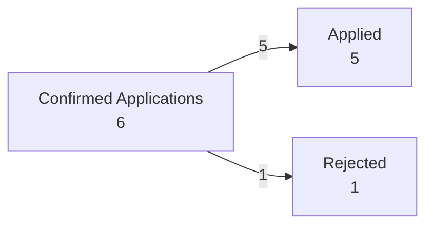

# Job Application Dashboard

_Last reviewed: 2026-08-17_

## Pipeline at a Glance

- **Confirmed applications tracked:** 6
- **Active:** 5
- **Rejected:** 1
- **Interviews / assessments / offers:** 0

## Pipeline Flow

> This flow is regenerated whenever the tracker is reconciled. As applications advance, the diagram should expand to show recruiter screens, interviews, assessments, final stages, offers, and terminal outcomes using confirmed tracker history.

## Pipeline Summary

| Status | Count |
|---|---:|
| Considering | 0 |
| Applied | 5 |
| Recruiter Screen | 0 |
| Interview | 0 |
| Assessment | 0 |
| Final Stage | 0 |
| Offer | 0 |
| Rejected | 1 |
| Withdrawn | 0 |
| Closed / No Response | 0 |

## Active Applications

| Company | Role | Location | Category | Applied | Status | Last Update |
|---|---|---|---|---|---|---|
| Capital One | Associate, Software Engineer, New Grad Card Expansion | Not confirmed | Software Engineering | 2026-08-10 | Applied | 2026-08-10 |
| WSP | Early Professional, Transmission Line Engineer/Designer | Edmonton, AB | Power/Grid | 2026-08-11 | Applied | 2026-08-11 |
| Phasor Engineering Inc | Electrical EIT | Not confirmed | Electrical Engineering | 2026-08-11 | Applied | 2026-08-11 |
| TRS Staffing Solutions | Electrical Project Engineer | British Columbia, Canada | Electrical / Project Engineering | 2026-08-11 | Applied | 2026-08-11 |
| Morson Edge | Junior Engineer - NERC | Edmonds, BC (Hybrid; LinkedIn header lists Burnaby, BC) | Power/Grid / OT & NERC | 2026-08-14 | Applied | 2026-08-16 |

## Closed / Terminal Applications

| Company | Role | Applied | Status | Last Update |
|---|---|---|---|---|
| Boston Scientific | Systems Engineer I | Not confirmed | Rejected | 2026-08-11 |

## Follow-Ups / Action Items

- Monitor Capital One for recruiter or hiring-team follow-up. Under the tracker aging rule, close as `Closed / No Response` after 30 calendar days without employer activity unless there is evidence the process remains active.
- Monitor WSP for recruiter follow-up after application confirmation and identity verification.
- Monitor Phasor Engineering for employer response.
- Monitor TRS Staffing Solutions for employer or recruiter follow-up.
- Monitor Morson Edge / BC Hydro for recruiter follow-up. Morson Edge viewed the application on 2026-08-16, resetting the inactivity-aging clock from that employer activity.

## Recent Changes

See [[System/Update Log]].

## Notes

- Individual applications live in `Applications/`.
- The dashboard should reflect the current state of those notes.
- Historical status changes belong in each application note and in the update log when material.
- August email review intentionally excludes job alerts and other messages that do not confirm an application was submitted.
- Employer candidate-portal confirmation supplied directly by Suhas is valid submission evidence even when no confirmation email exists.
- Direct user confirmation of a completed LinkedIn Easy Apply submission is also valid application evidence.
